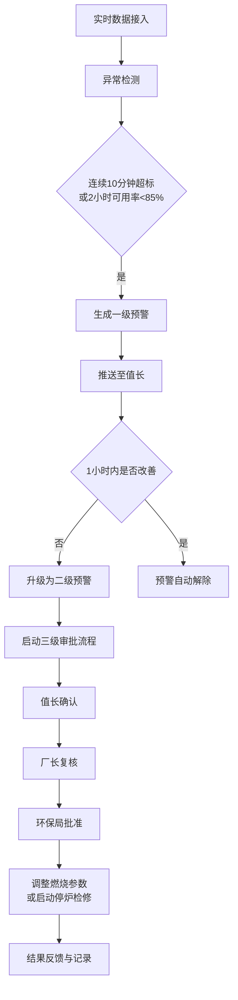
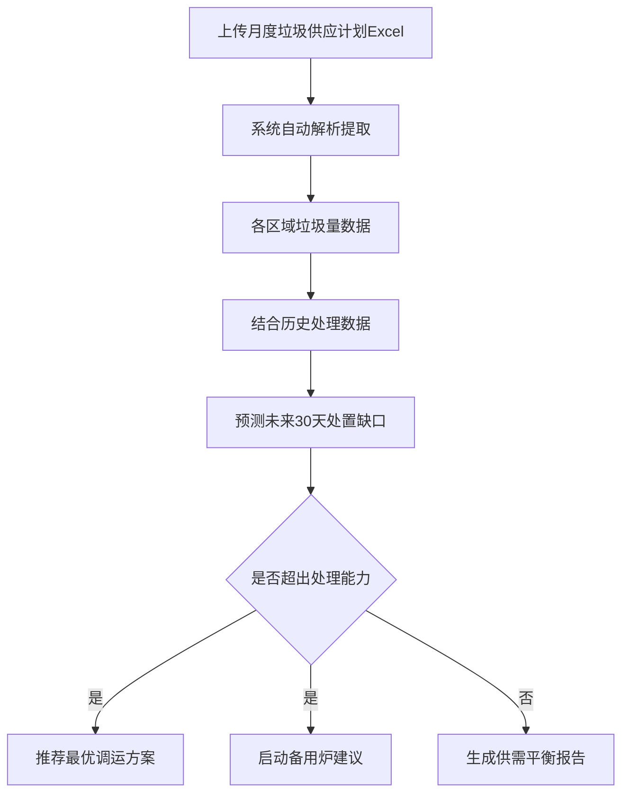

## 1. 产品概述

全国性垃圾焚烧发电厂运营与排放监测分析平台，实时接入全国各电厂生产运行数据，实现智能化监控、预警、分析与决策支持。

- 主要解决垃圾焚烧电厂分散运营、监管困难、排放超标风险高、资源调度效率低等问题
- 目标用户包括集团管理层、区域运营人员、工厂值长、厂长及环保监管部门
- 产品价值：提升运营效率20%，降低排放超标率30%，优化资源调配，辅助科学决策

## 2. 核心功能

### 2.1 用户角色

| 角色 | 注册方法 | 核心权限 |
|------|----------|----------|
| 集团管理员 | 系统预置 | 查看全国所有工厂数据，管理用户权限，生成集团级报表 |
| 区域管理员 | 集团创建 | 查看所辖区域工厂数据，审批区域级操作，生成区域报表 |
| 工厂值长 | 区域创建 | 查看本厂实时数据，处理预警，确认审批流程，操作燃烧参数 |
| 工厂厂长 | 区域创建 | 查看本厂全部数据，复核审批流程，审批停炉检修，管理工厂配置 |
| 环保局用户 | 系统预置 | 查看区域排放数据，批准重大调整操作，监管排放合规性 |

### 2.2 功能模块

1. **实时监控看板**：全国热力图、发电效率排名、关键指标概览、省份切换
2. **工厂详情页**：7天发电趋势、排放浓度分布、设备维修时间线、机组详情
3. **预警管理**：一级/二级预警列表、预警推送、预警处理记录
4. **审批流程**：三级审批（值长确认→厂长复核→环保局批准）、审批历史
5. **预测调运**：Excel上传、垃圾供应计划、30天缺口预测、调运方案推荐
6. **运营报告**：周报自动生成、同比环比分析、排名对比、优化建议
7. **权限管理**：用户管理、角色分配、数据范围控制
8. **数据接入**：实时数据接入、数据清洗、自动聚合计算

### 2.3 页面详情

| 页面名称 | 模块名称 | 功能描述 |
|----------|----------|----------|
| 登录页 | 身份认证 | 用户名密码登录、角色自动识别、权限跳转 |
| 核心看板 | 概览卡片 | 今日垃圾处理量、总发电量、排放达标率、设备可用率关键指标展示 |
| 核心看板 | 省份切换器 | 下拉选择省份/区域，数据联动过滤 |
| 核心看板 | 全国热力图 | 按省份展示垃圾处理量热力分布，支持点击下钻 |
| 核心看板 | 效率排名榜 | 工厂发电效率排名，支持按指标切换排序 |
| 核心看板 | 实时预警栏 | 滚动展示当前活跃预警，点击跳转预警详情 |
| 工厂详情 | 工厂概览 | 工厂基本信息、今日核心指标、当前运行状态 |
| 工厂详情 | 发电趋势图 | 近7天各机组发电量趋势曲线，支持指标切换 |
| 工厂详情 | 排放分布图 | SO2、NOx、颗粒物浓度分布柱状图/雷达图 |
| 工厂详情 | 设备时间线 | 设备维修、保养、故障事件时间线展示 |
| 工厂详情 | 机组列表 | 各机组运行参数实时展示 |
| 预警中心 | 预警列表 | 一级/二级预警分类展示，支持筛选、搜索 |
| 预警中心 | 预警详情 | 预警原因、持续时间、超标数据、处理建议 |
| 预警中心 | 预警处理 | 记录处理措施、升级/关闭预警 |
| 审批中心 | 待办审批 | 值长、厂长、环保局待处理审批事项 |
| 审批中心 | 审批表单 | 审批意见、附件上传、状态流转 |
| 审批中心 | 审批历史 | 完整审批流程追溯 |
| 预测调运 | Excel上传 | 月度垃圾供应计划Excel文件上传与解析 |
| 预测调运 | 缺口预测 | 未来30天处置缺口预测图表展示 |
| 预测调运 | 方案推荐 | 最优调运方案、备用炉启动建议 |
| 运营报告 | 报告列表 | 周报列表，支持查看、下载 |
| 运营报告 | 报告详情 | 完整运营诊断报告，含图表和优化建议 |
| 系统管理 | 用户管理 | 用户增删改查、角色分配 |
| 系统管理 | 工厂配置 | 工厂信息、机组配置、排放标准设置 |

## 3. 核心流程

### 3.1 预警与审批流程

实时数据接入→异常检测→连续10分钟超标/2小时可用率低→生成一级预警→推送值长→1小时未改善→升级二级预警→启动三级审批→值长确认→厂长复核→环保局批准→调整参数/停炉检修→结果反馈

### 3.2 预测调运流程

上传月度供应计划Excel→系统解析提取各区域垃圾量→结合历史处理能力→预测未来30天处置缺口→超出处理能力→推荐最优调运方案/启动备用炉

## 4. 用户界面设计

### 4.1 设计风格

- **主色调**：科技蓝 `#0A2463`，代表专业、可靠、工业感
- **辅助色**：警示橙 `#E63946`（预警）、成功绿 `#2A9D8F`（正常）、警告黄 `#F4A261`（注意）
- **中性色**：深灰 `#1A1A2E` 背景、浅灰 `#F8F9FA` 卡片、白色 `#FFFFFF` 内容区
- **按钮风格**：直角微圆角（4px），2px边框，悬浮阴影提升，点击凹陷效果
- **字体**：标题使用 `Noto Sans SC` 粗体，正文使用 `Noto Sans SC` 常规体
- **布局风格**：左侧导航栏 + 顶部状态栏 + 主内容区，卡片式布局，数据可视化突出
- **图标风格**：使用 lucide-react 线性图标，统一16px/20px/24px尺寸
- **整体风格**：工业科技风，深色主题，数据大屏质感，强调数据可视化的专业性

### 4.2 页面设计概述

| 页面名称 | 模块名称 | UI元素 |
|----------|----------|--------|
| 核心看板 | 概览卡片 | 渐变背景卡片、发光边框、大号数字、实时更新动画 |
| 核心看板 | 全国热力图 | SVG中国地图、省份热区着色、tooltip悬浮详情、点击交互 |
| 核心看板 | 效率排名榜 | 表格+进度条、前三名高亮、排序切换动画 |
| 工厂详情 | 发电趋势图 | ECharts折线图、多系列对比、缩放控件、时间选择器 |
| 工厂详情 | 排放分布图 | 雷达图+柱状图、达标线标记、超标区域高亮 |
| 工厂详情 | 设备时间线 | 垂直时间轴、事件节点、状态色标、悬停详情 |
| 预警中心 | 预警卡片 | 色带标识等级、闪烁动画、倒计时显示、快捷操作按钮 |
| 审批中心 | 审批流程 | 横向步骤条、当前节点高亮、审批人头像、时间戳 |
| 预测调运 | 缺口预测 | 面积图预测区间、警戒线、缺口区域填充高亮 |
| 运营报告 | 报告页面 | 页眉页脚、分章节布局、图表混排、打印优化 |

### 4.3 响应式设计

- **桌面端优先**：主要面向监控大屏和办公桌面，设计宽度1920px
- **平板适配**：1024px断点，侧边栏可折叠，图表自适应
- **移动端**：768px断点，底部导航，卡片单列布局，关键指标优先展示
- **触控优化**：按钮最小44x44px，滑动手势支持图表缩放

### 4.4 数据可视化规范

- **实时数据**：数字滚动动画，更新间隔5秒，数据变化趋势箭头指示
- **图表配色**：统一色板，正常数据蓝色系，异常数据红色系，对比色互补
- **告警动画**：超标数据脉冲闪烁，预警卡片呼吸灯效果
- **加载状态**：骨架屏占位，数据渐入动画
