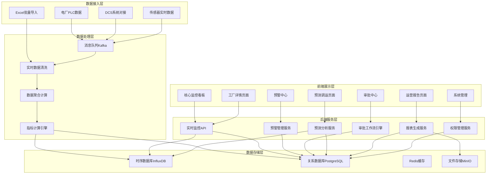
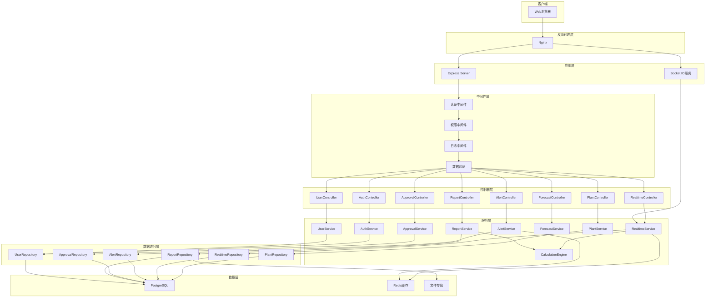
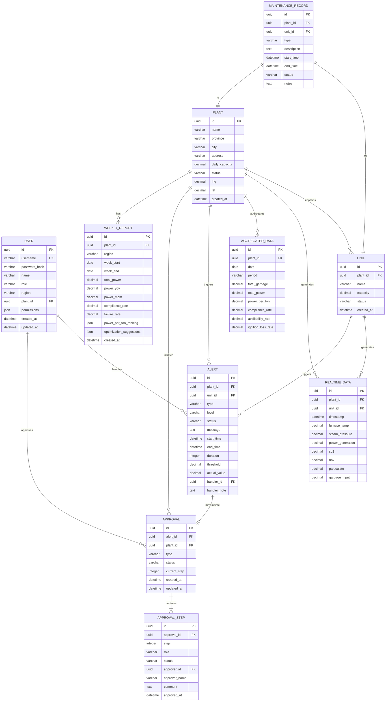

## 1. 架构设计



## 2. 技术描述

- **前端**：React@18 + TypeScript + Vite + TailwindCSS@3 + Zustand + React Router@6 + ECharts@5 + lucide-react
- **后端**：Express@4 + TypeScript + Node.js
- **数据库**：PostgreSQL@15（业务数据）+ 模拟时序数据（使用内存存储模拟）
- **实时通信**：Socket.IO（模拟实时数据推送）
- **Excel处理**：SheetJS (xlsx)
- **图表可视化**：ECharts@5（热力图、折线图、柱状图、雷达图等）
- **状态管理**：Zustand（前端状态）
- **HTTP客户端**：Axios
- **工具库**：date-fns（日期处理）、zod（数据验证）

## 3. 路由定义

| 路由路径 | 页面名称 | 权限要求 |
|----------|----------|----------|
| /login | 登录页 | 公开 |
| /dashboard | 核心监控看板 | 所有登录用户 |
| /factory/:id | 工厂详情页 | 所有登录用户（按权限过滤） |
| /alerts | 预警中心 | 值长、厂长、管理员 |
| /approvals | 审批中心 | 值长、厂长、环保局、管理员 |
| /forecast | 预测调运 | 厂长、管理员 |
| /reports | 运营报告 | 所有登录用户（按权限过滤） |
| /settings/users | 用户管理 | 集团管理员 |
| /settings/factories | 工厂配置 | 集团、区域管理员 |

## 4. API 定义

### 4.1 类型定义

```typescript
// 共享类型定义
export interface Plant {
  id: string;
  name: string;
  province: string;
  city: string;
  address: string;
  capacity: number; // 日处理能力（吨）
  units: Unit[];
  status: 'running' | 'stopped' | 'maintenance';
  createdAt: Date;
}

export interface Unit {
  id: string;
  plantId: string;
  name: string;
  capacity: number;
  status: 'running' | 'stopped' | 'standby';
}

export interface RealtimeData {
  id: string;
  plantId: string;
  unitId: string;
  timestamp: Date;
  furnaceTemp: number; // 炉温(°C)
  steamPressure: number; // 蒸汽压力(MPa)
  powerGeneration: number; // 发电量(kWh)
  so2: number; // 二氧化硫(mg/m³)
  nox: number; // 氮氧化物(mg/m³)
  particulate: number; // 颗粒物(mg/m³)
  garbageInput: number; // 垃圾入炉量(吨)
}

export interface AggregatedData {
  id: string;
  plantId: string;
  date: Date;
  period: 'hour' | 'day' | 'month';
  totalGarbage: number;
  totalPower: number;
  powerPerTon: number; // 吨垃圾发电量
  complianceRate: number; // 排放达标率
  availabilityRate: number; // 设备可用率
  ignitionLossRate: number; // 热灼减率
}

export interface Alert {
  id: string;
  plantId: string;
  unitId: string;
  type: 'emission' | 'availability' | 'temperature' | 'pressure';
  level: 'level1' | 'level2';
  status: 'active' | 'acknowledged' | 'resolved' | 'escalated';
  message: string;
  startTime: Date;
  endTime?: Date;
  duration: number; // 分钟
  threshold: number;
  actualValue: number;
  handlerId?: string;
  handlerNote?: string;
}

export interface Approval {
  id: string;
  alertId: string;
  plantId: string;
  type: 'parameter_adjust' | 'shutdown';
  status: 'pending_shift' | 'pending_manager' | 'pending_epb' | 'approved' | 'rejected';
  currentStep: number;
  steps: ApprovalStep[];
  createdAt: Date;
  updatedAt: Date;
}

export interface ApprovalStep {
  id: string;
  step: number;
  role: 'shift_supervisor' | 'plant_manager' | 'epb';
  status: 'pending' | 'approved' | 'rejected';
  approverId?: string;
  approverName?: string;
  comment?: string;
  approvedAt?: Date;
}

export interface User {
  id: string;
  username: string;
  name: string;
  role: 'group_admin' | 'region_admin' | 'shift_supervisor' | 'plant_manager' | 'epb';
  region?: string;
  plantId?: string;
  permissions: string[];
}

export interface ForecastResult {
  date: Date;
  supply: number;
  capacity: number;
  gap: number;
  recommendations: string[];
}

export interface WeeklyReport {
  id: string;
  plantId?: string;
  region?: string;
  weekStart: Date;
  weekEnd: Date;
  totalPower: number;
  powerYoY: number;
  powerMoM: number;
  complianceRate: number;
  failureRate: number;
  powerPerTonRanking: { plantId: string; plantName: string; value: number }[];
  optimizationSuggestions: string[];
}
```

### 4.2 API 接口列表

| 方法 | 路径 | 描述 | 请求体 | 响应体 |
|------|------|------|--------|--------|
| POST | /api/auth/login | 用户登录 | { username, password } | { token, user } |
| GET | /api/plants | 获取工厂列表 |  | Plant[] |
| GET | /api/plants/:id | 获取工厂详情 |  | Plant |
| GET | /api/realtime/current | 获取实时数据 | ?plantId | RealtimeData[] |
| GET | /api/realtime/history | 获取历史数据 | ?plantId&startDate&endDate | RealtimeData[] |
| GET | /api/aggregated | 获取聚合数据 | ?plantId&period&startDate&endDate | AggregatedData[] |
| GET | /api/alerts | 获取预警列表 | ?plantId&level&status | Alert[] |
| POST | /api/alerts/:id/acknowledge | 确认预警 | { handlerNote } | Alert |
| POST | /api/alerts/:id/resolve | 解决预警 | { resolutionNote } | Alert |
| GET | /api/approvals | 获取审批列表 | ?status&role | Approval[] |
| POST | /api/approvals/:id/approve | 审批通过 | { step, comment } | Approval |
| POST | /api/approvals/:id/reject | 审批拒绝 | { step, comment, reason } | Approval |
| POST | /api/forecast/upload | 上传供应计划Excel | FormData(file) | { parsedData } |
| GET | /api/forecast/gap | 获取缺口预测 | ?plantId&days | ForecastResult[] |
| GET | /api/reports/weekly | 获取周报列表 | ?plantId&page | WeeklyReport[] |
| GET | /api/reports/weekly/:id | 获取周报详情 |  | WeeklyReport |
| POST | /api/reports/weekly/generate | 生成周报 | { plantId, weekStart } | WeeklyReport |
| GET | /api/users | 获取用户列表 |  | User[] |
| POST | /api/users | 创建用户 | User | User |
| PUT | /api/users/:id | 更新用户 | User | User |
| DELETE | /api/users/:id | 删除用户 |  | { success } |

## 5. 服务器架构图



## 6. 数据模型

### 6.1 ER图



### 6.2 DDL 语句

```sql
-- 用户表
CREATE TABLE users (
    id UUID PRIMARY KEY DEFAULT gen_random_uuid(),
    username VARCHAR(50) UNIQUE NOT NULL,
    password_hash VARCHAR(255) NOT NULL,
    name VARCHAR(100) NOT NULL,
    role VARCHAR(20) NOT NULL CHECK (role IN ('group_admin', 'region_admin', 'shift_supervisor', 'plant_manager', 'epb')),
    region VARCHAR(50),
    plant_id UUID REFERENCES plants(id),
    permissions JSONB DEFAULT '[]',
    created_at TIMESTAMP DEFAULT CURRENT_TIMESTAMP,
    updated_at TIMESTAMP DEFAULT CURRENT_TIMESTAMP
);

-- 工厂表
CREATE TABLE plants (
    id UUID PRIMARY KEY DEFAULT gen_random_uuid(),
    name VARCHAR(100) NOT NULL,
    province VARCHAR(50) NOT NULL,
    city VARCHAR(50) NOT NULL,
    address VARCHAR(255),
    daily_capacity DECIMAL(10,2) NOT NULL,
    status VARCHAR(20) NOT NULL DEFAULT 'running',
    lng DECIMAL(10,6),
    lat DECIMAL(10,6),
    created_at TIMESTAMP DEFAULT CURRENT_TIMESTAMP
);

-- 机组表
CREATE TABLE units (
    id UUID PRIMARY KEY DEFAULT gen_random_uuid(),
    plant_id UUID REFERENCES plants(id) NOT NULL,
    name VARCHAR(50) NOT NULL,
    capacity DECIMAL(10,2) NOT NULL,
    status VARCHAR(20) NOT NULL DEFAULT 'running',
    created_at TIMESTAMP DEFAULT CURRENT_TIMESTAMP
);

-- 实时数据表
CREATE TABLE realtime_data (
    id UUID PRIMARY KEY DEFAULT gen_random_uuid(),
    plant_id UUID REFERENCES plants(id) NOT NULL,
    unit_id UUID REFERENCES units(id) NOT NULL,
    timestamp TIMESTAMP NOT NULL,
    furnace_temp DECIMAL(8,2),
    steam_pressure DECIMAL(6,2),
    power_generation DECIMAL(12,2),
    so2 DECIMAL(8,2),
    nox DECIMAL(8,2),
    particulate DECIMAL(8,2),
    garbage_input DECIMAL(10,2)
);
CREATE INDEX idx_realtime_plant_time ON realtime_data(plant_id, timestamp DESC);
CREATE INDEX idx_realtime_unit_time ON realtime_data(unit_id, timestamp DESC);

-- 聚合数据表
CREATE TABLE aggregated_data (
    id UUID PRIMARY KEY DEFAULT gen_random_uuid(),
    plant_id UUID REFERENCES plants(id) NOT NULL,
    date DATE NOT NULL,
    period VARCHAR(10) NOT NULL CHECK (period IN ('hour', 'day', 'month')),
    total_garbage DECIMAL(12,2) DEFAULT 0,
    total_power DECIMAL(14,2) DEFAULT 0,
    power_per_ton DECIMAL(8,2) DEFAULT 0,
    compliance_rate DECIMAL(5,2) DEFAULT 100,
    availability_rate DECIMAL(5,2) DEFAULT 100,
    ignition_loss_rate DECIMAL(5,2) DEFAULT 0
);
CREATE UNIQUE INDEX idx_aggregated_plant_date_period ON aggregated_data(plant_id, date, period);

-- 预警表
CREATE TABLE alerts (
    id UUID PRIMARY KEY DEFAULT gen_random_uuid(),
    plant_id UUID REFERENCES plants(id) NOT NULL,
    unit_id UUID REFERENCES units(id),
    type VARCHAR(30) NOT NULL CHECK (type IN ('emission', 'availability', 'temperature', 'pressure')),
    level VARCHAR(10) NOT NULL CHECK (level IN ('level1', 'level2')),
    status VARCHAR(20) NOT NULL DEFAULT 'active',
    message TEXT NOT NULL,
    start_time TIMESTAMP NOT NULL,
    end_time TIMESTAMP,
    duration INTEGER DEFAULT 0,
    threshold DECIMAL(10,2) NOT NULL,
    actual_value DECIMAL(10,2) NOT NULL,
    handler_id UUID REFERENCES users(id),
    handler_note TEXT,
    created_at TIMESTAMP DEFAULT CURRENT_TIMESTAMP
);
CREATE INDEX idx_alerts_plant_status ON alerts(plant_id, status);

-- 审批表
CREATE TABLE approvals (
    id UUID PRIMARY KEY DEFAULT gen_random_uuid(),
    alert_id UUID REFERENCES alerts(id),
    plant_id UUID REFERENCES plants(id) NOT NULL,
    type VARCHAR(30) NOT NULL CHECK (type IN ('parameter_adjust', 'shutdown')),
    status VARCHAR(30) NOT NULL CHECK (status IN ('pending_shift', 'pending_manager', 'pending_epb', 'approved', 'rejected')),
    current_step INTEGER NOT NULL DEFAULT 1,
    created_at TIMESTAMP DEFAULT CURRENT_TIMESTAMP,
    updated_at TIMESTAMP DEFAULT CURRENT_TIMESTAMP
);

-- 审批步骤表
CREATE TABLE approval_steps (
    id UUID PRIMARY KEY DEFAULT gen_random_uuid(),
    approval_id UUID REFERENCES approvals(id) NOT NULL,
    step INTEGER NOT NULL,
    role VARCHAR(30) NOT NULL CHECK (role IN ('shift_supervisor', 'plant_manager', 'epb')),
    status VARCHAR(20) NOT NULL DEFAULT 'pending',
    approver_id UUID REFERENCES users(id),
    approver_name VARCHAR(100),
    comment TEXT,
    approved_at TIMESTAMP
);

-- 设备维修记录表
CREATE TABLE maintenance_records (
    id UUID PRIMARY KEY DEFAULT gen_random_uuid(),
    plant_id UUID REFERENCES plants(id) NOT NULL,
    unit_id UUID REFERENCES units(id) NOT NULL,
    type VARCHAR(30) NOT NULL,
    description TEXT NOT NULL,
    start_time TIMESTAMP NOT NULL,
    end_time TIMESTAMP,
    status VARCHAR(20) NOT NULL DEFAULT 'scheduled',
    notes TEXT,
    created_at TIMESTAMP DEFAULT CURRENT_TIMESTAMP
);

-- 周报表
CREATE TABLE weekly_reports (
    id UUID PRIMARY KEY DEFAULT gen_random_uuid(),
    plant_id UUID REFERENCES plants(id),
    region VARCHAR(50),
    week_start DATE NOT NULL,
    week_end DATE NOT NULL,
    total_power DECIMAL(14,2) DEFAULT 0,
    power_yoy DECIMAL(6,2) DEFAULT 0,
    power_mom DECIMAL(6,2) DEFAULT 0,
    compliance_rate DECIMAL(5,2) DEFAULT 100,
    failure_rate DECIMAL(5,2) DEFAULT 0,
    power_per_ton_ranking JSONB,
    optimization_suggestions JSONB,
    created_at TIMESTAMP DEFAULT CURRENT_TIMESTAMP
);
CREATE UNIQUE INDEX idx_weekly_plant_week ON weekly_reports(plant_id, week_start);

-- 初始数据
INSERT INTO users (username, password_hash, name, role, permissions) VALUES
('admin', '$2b$10$...', '系统管理员', 'group_admin', '["all"]'),
('region_henan', '$2b$10$...', '河南区域管理员', 'region_admin', '["view_region", "manage_region_users"]');
```
